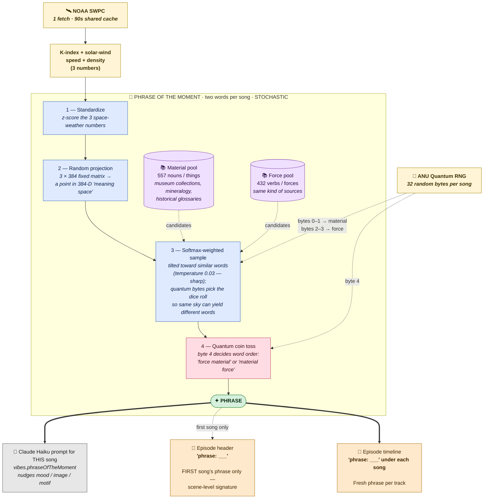

# Phrase-of-the-moment — derivation pipeline

A two-word phrase computed once per song (~3–6 min apart). The phrase surfaces
under each song in the episode timeline, and the first song's phrase is shown
in the episode header. It is also injected as `vibes.phraseOfTheMoment` in
the Claude composer prompt as flavor, not a directive.

(Word-of-the-moment was dropped; only the phrase pipeline below is live.)

---

---

## Key / colour legend

- **Yellow** — live data sources (fetched fresh per song)
- **Blue** — math / transform steps on the Worker
- **Purple** — vocabulary pools (pre-built offline, embedded in the Worker)
- **Pink** — quantum-driven steps (true randomness from ANU)
- **Green** — final output token
- **Grey** — Claude prompt (every song)
- **Orange** — what shows up in the UI

## Conceptual hooks worth knowing

1. **"Meaning space" is the trick.** The pipeline turns three live cosmic
   numbers into a 384-dimensional vector and looks up nearby words in that
   space. The vector itself is meaningless to a human — but it lets the sky
   steer the language.

2. **Stochastic, not deterministic.** Same space weather can pick different
   phrases because true quantum dice roll the softmax sample.

3. **The pools are pre-curated.** No LLM call happens in this live pipeline —
   that keeps it fast and free. The material/force pools come from open-text
   sources (museum catalogs, mineral glossaries, etc.).

4. **It's a nudge, not a directive.** The phrase goes to Claude as
   `vibes.phraseOfTheMoment` alongside the full stacked meta + lexicon
   context; Claude weaves it in if it fits. The visible phrase in the UI is
   the same token Claude saw — the user is reading the prompt's mood input.

5. **Header asymmetry is intentional.** The episode header shows the *first
   song's* phrase as a scene-level signature for the share card; the
   timeline shows each song's fresh phrase as a micro-caption.
